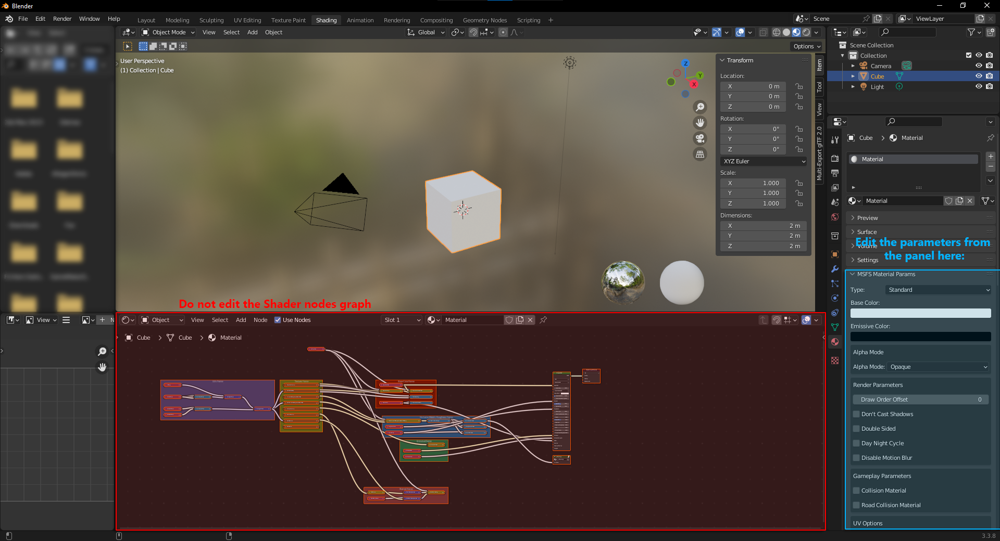
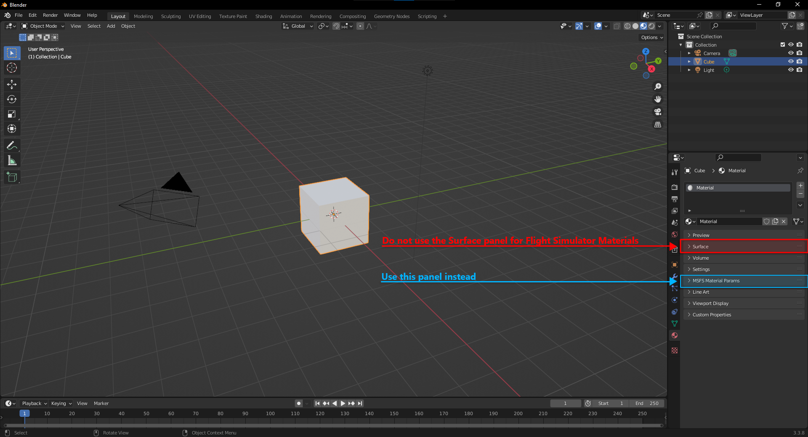

<!--   -->

# Documentation for Microsoft Flight Simulator glTF 2.0 Importer and Exporter for Blender

First of all, this addon adds some panels and options needed to have a correct model export ready to be used in the sim.

## Summary
1. [Materials Propreties](#materials)  
2. [Multi-Exporter glTF 2.0](#multi-exporter-gltf-20)

## Materials Propreties:
- When you select an object in Blender, you can access the material properties from the Object Ribbon on the right, under the Material Properties button. 

- When you want to export a model dedicated to Microsoft Flight Simulator, you need to set a Flight Simulator material to it:  

- When you set Flight Simulator Material, you can edit the material propreties from the MSFS Material Params only, if you edit the shader nodes it will break the export :

:warning: DO NOT EDIT THE SHADER PART

- If you want to learn more about the different materials listed and how to use them, you can refer to the SDK documentation here: https://docs.flightsimulator.com/html/Asset_Creation/3DS_Max_Plugin/Materials.htm

## Multi-Exporter glTF 2.0
- To export your model you need to use the multi-exporter view :
