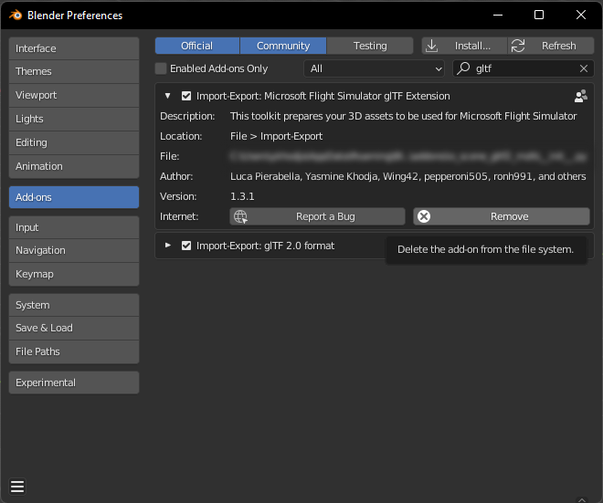

 

# Microsoft Flight Simulator 2020 glTF 2.0 Importer and Exporter for Blender

This repository contains the current version of the official Microsoft Flight Simulator 2020 Blender Import/Export plugin. The flight sim community has already developed and forked the original project many times, and Asobo's intention is to fully support Blender with the help and contributions of all the developers that have already implemented features in the different unofficial Blender plugins.

>Asobo would especially like to thank the following people:  
>Vitus of [Wing42](https://wing42.com/), [tml1024](https://github.com/tml1024), [ronh991](https://github.com/ronh991), [pepperoni505](https://github.com/pepperoni505) of [FlyByWire](https://flybywiresim.com/)

:warning: This plugin cannot import glTF files that have been built into a Microsoft Flight Simulator 2020 package through the Sim's Package Builder.
 

:warning: This plugin is NOT compatible with the legacy exporter developed for FSX and P3D.  Remove these plugin (Prefered) or disabled these plugins.
 

:warning: This addon need to have the `Import-Export: gltf 2.0 format` addon (gltf2 Khronos IO) **enabled** to work. Do not remove it or disable it !
 

:warning: Supported blender versions of the latest version of the addon:
- **3.3.x LTS**
- **3.6.x LTS**
- **4.2.x LTS**
- **4.5.x LTS** 
We can't guarantee not having bugs with other unstable versions 

*******

# Summary
- [How to Install the ASOBO Blender MSFS2020 Importer/Exporter using Blender:](#how-to-install-the-asobo-blender-msfs2020-importerexporter-using-blender)
- [How to remove the Add-on](#how-to-remove-the-add-on)
- [Migration of Legacy Blend File Material Types/Modes](#migration-of-legacy-blend-file-material-typesmodes)
  - [Steps For Migration](#steps-for-migration)
- [Documentation](#documentation)
- [Notes On Shadertree](#notes-on-shadertree)

## How to Install the ASOBO Blender MSFS2020 Importer/Exporter using Blender:

1. Go to the Releases section of the https://github.com/AsoboStudio/Microsoft-Flight-Simulator-2020-glTF-Blender-IO repository. Then download the zip file `io_scene_gltf2_msfs_2020.zip` of the latest release.

2. Open Blender and go to : Edit > Preferences.

3. Go to Add-ons and click on Install an add-on. This will bring up a file dialog, where you navigate to the folder where you have your `io_scene_gltf2_msfs_2020.zip` downloaded file.

4. Select the `io_scene_gltf2_msfs_2020.zip` file.  And click on the Install Add-on button.

5. Enable the Add-on by clicking on the checkbox.

 

# How to remove the Add-on

1. If you previously installed the Microsoft Flight Simulator 2020 glTF Extensions Add-on, Remove/Delete the older version using the Blender Edit > Preferences Menu. 

2. Select the Add-ons tab. Search for the `Microsoft Flight Simulator 2020 glTF Extension` Importer/Exporter add-on in the search box. Delete the `Import-Export: Microsoft Flight Simulator 2020 gltf Extension` using the `Remove` button.   
:warning: DO NOT DELETE OR DISABLE THE `Import-Export: gltf 2.0 format` Add-on.

3. You should now have only the `Import-Export: gltf 2.0 format` addon left.
4. Close the Blender program.

# Migration of Legacy Blend File Material Types/Modes

This Blender addon is now the officially supported addon for Microsoft Flight Simulator 2020, and as such, blend files that were made using any other version/iteration of the addon are now considred *legacy* blend files. Basically, legacy blend files had the extensions that are used to create glTF 2.0 files for use in the Microsoft Flight Simulator 2020 hard-coded into them. However, the ASOBO version of the exporter uses the Khronos default code and adds hooks to this code for the ASOBO extensions used in the glTF files.

The ASOBO exporter also has a much more complex and versitile material node structure that can be seen in the Shader Tab/Window in Blender. Your legacy Flight Simulator Material mode/types should be migrated to the new ASOBO Microsoft Flight SImulator 2020 material mode/types with the click of the "**`Migrate Material Data`**" button
in the MSFS2020 Material Parameters panel (under the Blender Material Properties). 

We have made every effort possible to ensure that legacy blend files can be easily and fully migrated to use this addon and exporter, and we recommend the migration to use this addon as soon as possible to ensure future compatibility as this addon evolves and is updated. 

Once you have performed a migration, you should look at the shader nodes in your *original* blend file and make sure the BSDF node paramerters are the same as the panel values.  This is an important check to make as these can get out of sync when you modify the parameters in the `Surface` section of the `Material Properties` panel instead of modifying them in the `MSFS2020 Material Parameters` section. In particular, pay attention to the *Metallic* and *Roughness* Scale and Factor values.

 

## Steps For Migration

1. Open your blend file.
2. Select a node/mesh
3. Open the `MSFS2020 Material Params` Panel in the Material Properties
    - You will see a `Migrate Material Data` button above the MSFS2020 Material Params type drop down list.
    - **DO NOT Select a MSFS2020 Material from the drop down**, this will erase the existing legacy data and you will lose all your material settings.
4. Click on the "Migrate Material Data" button
    - Your existing legacy material type/mode will be conoverted to the new ASOBO MSFS2020 material type shader node structure.

Figure 1 Before migration

Figure 2 After Migration

All the settings from the legacy node structure are copied to the ASOBO exporter shader node structure. As you can see from the images above, the ASOBO node structure is more complex and there are a lot more nodes. Sometimes some model developers have made changes to the legacy BSDF node that are *not* reflected in the `MSFS2020 Material Params` panel data - the variables that are migrated come instead from the *legacy* panel data, so there may be situations where your material will not look correct. This means that you will need to compare your legacy blend file materials to the new blend file Materials after migration to see if there are any issues like this one. You can do this by openeing another Blender instance and opening the legacy file in that, then comparing the MSFS2020 Material Params panel values with the legacy parameter values and adjusting them accordingly.

Note that each Microsoft Flight Simulator 2020 material will need to be migrated, but any mesh/nodes associated to that material will also have it's MSFS2020 Material Parameters migrated. 

Finally, you may also notice that some MSFS2020 Material Parameters show data but *cannot* be adjusted. This is in keeping with the ASOBO 3DS Max exporter material parameters.  Please raise an issue if this is not to your requirements.

## WARNING
After migration SAVE YOUR FILE AS A NEW FILE and keep your legacy blend file for future reference.

# Documentation
If you want to learn how to use this add-on you can refer to the documentation page here :
[Documentation for Microsoft Flight Simulator 2020 glTF 2.0 Importer and Exporter for Blender](./Documentation/Documentation.md)

You can also have a look at the SDK documentation of the plugin here : https://docs.flightsimulator.com/html/Asset_Creation/Blender_Plugin/The_Blender_Plugin.htm

# Notes On Shadertree

Shadertree modification directly impacts the result of the exporter. 
The properties of your material must only be modified through the `MSFS2020 Material Panel` section.

:warning: If you work with an MSFS2020 Material you should never modify the shader tree manually.

